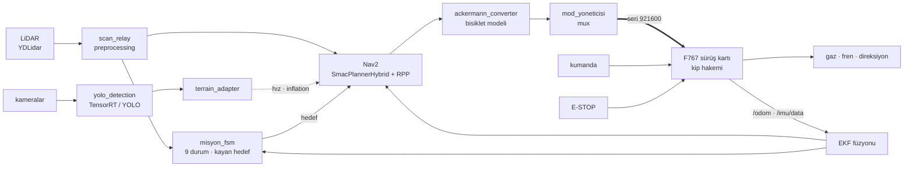

# LYDİA İKA — Otonom Sürüş Yazılımı

TEKNOFEST İnsansız Kara Aracı yarışması için geliştirilmiş, Ackermann bir araçta
koşan tam otonom sürüş yığını

TEKNOFEST 2026 İnsansız Kara Aracı yarışmasında **30 takım arasında 12. sırada**
tamamlandı (207,62 puan). Manuel koşuyu bitiren ilk 14 takım otonom koşuya geçme
hakkı kazandı; LYDİA o 14 aracın biri.

Jetson Orin Nano üzerinde koşan **23 ROS 2 düğümü**: LiDAR ve kamera algısı,
sensör füzyonu, Nav2 tabanlı navigasyon, görev durum makinesi ve aracın sürüş
kartıyla konuşan seri köprü. Parkurun 11 aşaması, her biri kendi arazi profili
ve süre bütçesiyle otonom olarak sürülür.

> Aracın **sürüş kartı firmware'i bu depoda yer almaz** — kart ayrı bir ekibin
> işi ve paylaşılmıyor. Burada olan, o kartla konuşan arayüzün Jetson tarafı ve
> kararı veren bütün katman.

---

## Sistem

Jetson hiçbir aktüatöre doğrudan komut göndermez: her komut sürüş kartının kip
hakeminden geçer ve kumanda her zaman önceliklidir. Üst bilgisayar çökse bile
manuel sürüş çalışmaya devam eder.

---

## Öne çıkan mühendislik kararları

### 🗺️ Haritasız navigasyon — hedef her döngüde taramadan üretilir

SLAM haritası ve waypoint koordinatı olmadan parkur sürülebiliyor. `kayan`
modda hedef, LiDAR taramasından çıkarılan koridor merkez çizgisinden her döngüde
yeniden üretilir; aşama **koordinata varışla değil, `mesafe_m` kadar yol kat
edilmesiyle** biter. Mesafeler yarışma CAD dosyasından planlayıcıyla ölçüldü —
kuş uçuşu değil, gerçek yol uzunluğu.

Sonucu şu: haritanın bozulması ya da dönüşümün ölçülmemiş olması koşuyu
durdurmuyor. → [`docs/GOREV.md`](docs/GOREV.md)

### 🌲 Kendi davranış ağaçları — stok ağaç aracı hiç kaldıramıyordu

Nav2'nin varsayılan davranış ağacındaki `Spin` düğümü Ackermann bir araçta
`bt_navigator`'ı düşürüyor: araç yerinde dönemediği için davranış hiç
tamamlanmıyor ve bringup'ın tamamı iptal ediliyor. Belirti yanıltıcıydı — Nav2
"ayağa kalkmadı" görünüyordu, sebebi tek bir düğümdü.

`Spin`siz kendi ağaçlarımız yazıldı, kurtarma `BackUp` ile kuruldu.
→ [`config/bt/`](config/bt) · [`docs/NAV2.md`](docs/NAV2.md)

### 🧪 Kararlar ROS'tan ayrı bir katmanda, davranışla sınanıyor

Kritik kararlar düğümlerin içinde değil, ROS'a hiç bağlı olmayan
[`pure_logic.py`](teknofest_ika/otonomi/pure_logic.py) içinde duruyor. Sebebi
basit: bir kapı `execute()` gövdesinde kalırsa test edilemez.

**1053 birim test** yapılandırma ile kodun tutarlılığını, açılış betiğinin
düğümlere gerçekte ne geçirdiğini ve durum makinesinin geçiş grafiğini AST
üzerinden denetliyor. Testler **mutasyonla** doğrulanıyor: kararı bilerek
bozmak testi kırmıyorsa o test zayıf sayılıp yeniden yazılıyor.

### 📉 "0 bir ölçümdür, ölçüm yokluğu değil"

Sürüş kartı, tekerlek ölçeği girilmemişken hız alanını bilerek `0` basıyor.
`/odom` o hâlde de 50 Hz akmaya devam ediyor, damgası taze olduğu için bütün
bayatlık kapılarını geçiyor — ve o `0`, "ölçüm yok" olarak değil **"0 m/s
ölçtüm" olarak, düşük kovaryansla** EKF'e giriyor. Filtre aracı emin biçimde
başlangıç noktasında tutuyor: araç fiziksel olarak sürerken planlayıcı onu
hareketsiz sanıyor.

Akış kesilmediği için hiçbir sessizlik denetimi bunu göremiyordu. Karşı
denetim, mevcut "enkoder sessiz" kapısının **aynası** olarak kuruldu ve ikisi
tasarım gereği aynı anda doğru olamıyor: biri *sayım sabit*, öteki *sayım
dönüyor* koşuluyla çalışıyor. Ayrımın değeri teşhiste — sayım durmuşsa sorun
kabloda, sayım dönerken hız alanı 0 kalıyorsa ölçek kartta yok.

---

## Neyi nerede bulursunuz

| Belge | İçerik |
|---|---|
| [`docs/MIMARI.md`](docs/MIMARI.md) | Sistem mimarisi, TF zinciri, topic arayüzleri, E-STOP ve mod sistemi |
| [`docs/DUGUMLER.md`](docs/DUGUMLER.md) | 23 düğümün tek tek görevi ve paket yapısı |
| [`docs/NAV2.md`](docs/NAV2.md) | Planlayıcı ve kontrolcü yapılandırması, davranış ağaçları, EKF füzyonu |
| [`docs/GOREV.md`](docs/GOREV.md) | Görev durum makinesi ve parkurun 11 aşaması |
| [`docs/DONANIM.md`](docs/DONANIM.md) | Araç donanımı ve Ackermann parametreleri |
| [`docs/KURULUM.md`](docs/KURULUM.md) | Kurulum, derleme ve çalıştırma |
| [`docs/OLCUMLER.md`](docs/OLCUMLER.md) | Hangi sabit ölçüldü, hangisi bekliyor ve **nasıl ölçülür** |
| [`donanim/PROTOKOL_F767.md`](donanim/PROTOKOL_F767.md) | Jetson ↔ sürüş kartı arayüz sözleşmesi |

---

## Hızlı bakış

| | |
|---|---|
| ROS 2 düğümü | 23 |
| Birim test | 1053 |
| Görev durumu | 9 (`IDLE → NAVIGATE → …`) |
| Parkur aşaması | 11 · toplam 111,9 m · 540 s aşama bütçesi |
| Arazi profili | 8 — tabela tespitine göre çalışma anında uygulanır |
| Araç | 1,83 × 1,22 m · dingil arası 1,44 m · Rmin 2,49 m |
| Planlayıcı | SmacPlannerHybrid (REEDS_SHEPP) + Regulated Pure Pursuit |
| Füzyon | robot_localization EKF — kart odometrisi + BNO055 |

---

## Bu depoda bilerek olmayanlar

- **Sürüş kartı firmware'i.** Ayrı bir ekibin işi ve paylaşılmıyor; burada
  yalnız kartın dış arayüzü tanımlı.
- **Eğitilmiş model ağırlıkları** (`models/`). Büyük ikili dosyalar ve türetildikleri
  araç AGPL-3.0; depo onları dağıtmıyor. Üretim yolu
  [`scripts/export_tensorrt.py`](scripts/export_tensorrt.py).
- **Ölçülmemiş kalibrasyon değerleri.** Yerlerinde yer tutucu ve **nasıl ölçüleceği**
  var — uydurma bir sayı, eksik sayıdan kötüdür.
- **Ağ yapılandırması ve cihaz adresleri.** Depoda tutulmuyor.
- **Donanım arşivi ve iç geliştirme notları.** Çalışma deposunda kalıyor.

---

## Lisans

[Apache License 2.0](LICENSE). Kullanabilir, değiştirebilir ve dağıtabilirsiniz;
telif bildirimini ve [`NOTICE`](NOTICE) dosyasını korumanız gerekir.

Çalışma zamanı bağımlılıkları (ROS 2, Nav2, slam_toolbox, OpenCV ve diğerleri)
ayrıca kurulur ve her biri kendi lisansıyla dağıtılır. YOLO çıkarımının isteğe
bağlı Ultralytics yolu AGPL-3.0'dır ve bu depo onu dağıtmaz — ayrıntı
[`requirements.txt`](requirements.txt) içinde.

---

## Katkıda bulunanlar

### Buğra Öztürk ([@bugraozturk012](https://github.com/bugraozturk012)) — otonom sürüş yazılımı

Jetson üzerinde koşan bütün karar katmanı: algı, füzyon, navigasyon, görev yönetimi ve
sürüş kartıyla konuşan köprü. Bu depodaki 23 ROS 2 düğümünün tamamı ve 1.053 birim test.

- **Görev durum makinesi** — [`misyon_fsm.py`](teknofest_ika/otonomi/misyon_fsm.py) (2.700 satır):
  SMACH ile dokuz durum. Kayan hedef sürüşü (hedefler her döngüde LiDAR taramasından
  üretilir; haritaya da waypoint koordinatına da ihtiyaç yok), §6.10 rampa ve §6.11 hızlanma
  için Nav2 baypasları, atış yaklaşma/atış zinciri, hata kurtarma ve koşu süresi bütçesi.
- **Saf mantık katmanı** — [`pure_logic.py`](teknofest_ika/otonomi/pure_logic.py) (1.500 satır):
  ROS'tan bağımsız karar fonksiyonları. Ackermann kinematiği, koridor merkez çizgisi ve iç
  duvar takibi, kayan hedef üretimi, geri kayma riski, kart ayarlarının kodlanması, sensör
  ve ölçek kapıları. Kararlar düğümlerden buraya taşındı ki davranışla sınanabilsinler.
- **Sürüş kartı köprüsü** — [`seri_kopru.py`](teknofest_ika/gomulu/seri_kopru.py) (1.200 satır):
  arayüz sözleşmesinin Jetson tarafı, `0x09` ayar paketleri ve kalıcılığı, E-STOP zinciri,
  IMU ve odometri yayını, enkoder sessizliği ile ölçek denetimleri.
- **Navigasyon** — [`config/nav2_params.yaml`](config/nav2_params.yaml): ölçülmüş gövde ayak izi,
  SmacPlannerHybrid + Regulated Pure Pursuit ve kendi davranış ağaçları
  ([`config/bt/`](config/bt)) — stok ağaçtaki `Spin` düğümü Ackermann araçta `bt_navigator`'ı
  düşürüyordu. [`config/ekf.yaml`](config/ekf.yaml) ile enkoder + IMU füzyonu.
- **Görüntü işleme** — tabela tespiti (YOLO / TensorRT), koni ve kayar engel costmap
  besleyicileri, Kalman takibi, şerit tespiti, yağmur damlası onarımı, taret nişan düğümü.
- **Emniyet düğümleri** — `mod_yoneticisi`, `e_stop_node`, `watchdog`, `anti_rollback`,
  `imu_guvenlik`: kip hakemliği, dört E-STOP kaynağının birleştirilmesi, düğüm gözcülüğü,
  eğimde geri kayma koruması.
- **Parkur analizi** — [`scripts/parkur_cad/`](scripts/parkur_cad): TEKNOFEST'in yayımladığı
  STEP dosyasından tabela ve bariyer konumlarının çıkarılması, aşama mesafelerinin
  planlayıcıyla ölçülmesi, U dönüşü ve koni slalomu geçilebilirlik analizi.
- **Açılış ve saha araçları** — [`scripts/lydia_startup.sh`](scripts/lydia_startup.sh)
  (1.265 satır): düğümlerin sıralı başlatılması, ortam değişkeni kapıları, ön koşul
  doğrulamaları ve süreç gözcüsü. Web tabanlı araç panosu
  ([`scripts/web_dashboard.py`](scripts/web_dashboard.py), 1.689 satır).
- **Birim testleri** — [`test_birim.py`](test_birim.py): 1.053 test. Yapılandırma ile kod
  arasındaki tutarlılık, açılış betiğinin gerçekten ne geçirdiği ve durum makinesinin
  geçiş grafiği dahil; testler mutasyonla doğrulanıyor.

### Ahmet Efe NEZLİ ([@dwifk0](https://github.com/dwifk0)) — araç elektroniği ve sürüş kartı

Aracın Jetson altındaki bütün katmanı: kumandadan tekerleğe giden zincir, güç, emniyet ve
Jetson'la konuşan arayüz.

- **Sürüş kartı firmware'i (Nucleo-F767ZI)** — gaz (DAC ile BLDC kontrolcü), fren (BTS7960),
  step motorlu direksiyon ve jog kipi, iBUS kumanda ve failsafe, kip hakemi
  (manuel / otonom / DUR), E-STOP ve emniyet mandalları, tekerlek enkoderi ile hız ölçümü,
  BNO055 IMU, taret sürüşü. Önceki dönemde Arduino Mega üzerinde röleli direksiyon + ESC frenli
  ilk sürüş firmware'i.
- **Jetson ↔ kart arayüz sözleşmesi** — [`donanim/PROTOKOL_F767.md`](donanim/PROTOKOL_F767.md),
  [`teknofest_ika/gomulu/f767_protokol.py`](teknofest_ika/gomulu/f767_protokol.py) ve
  `seri_kopru.py`'nin F767 desteği: paket çerçevesi, fiziksel birimle komut, telemetri ve
  sağlık bayrakları.
- **Araç elektroniği** — bağlantı haritası ve kablolama, ana batarya (16S LiFePO4 + JK BMS) ve
  ayrı elektronik bataryası (4S + DALY), sigorta ve güç dağıtımı, acil stop devresi,
  motor kontrolcüsü bağlantıları, malzeme listesi ve seçimleri.
- **Araç panosu ve saha araçları** — web tabanlı araç panosu (telemetri, BMS'lerin BLE ile
  okunması, kamera akışları), Jetson açılış servisleri (`scripts/lydia_startup.sh`),
  araç ağı ve ekip uzaktan erişimi, tezgâh test düzeni ve testleri.

Kart firmware'i bu depoda yer almaz. Karar katmanının platformdan bağımsız, birim testli
sürümü: [dwifk0/IKA-MAGNESIA-LYDIA](https://github.com/dwifk0/IKA-MAGNESIA-LYDIA).

### Emeği geçenler

Taret çalışmalarında **Ümit Akpınar** ([@umitakpinarr](https://github.com/umitakpinarr))
emeği geçti; o tarafın kodu kendi dalında tutuluyor ve bu depoda yer almıyor.
